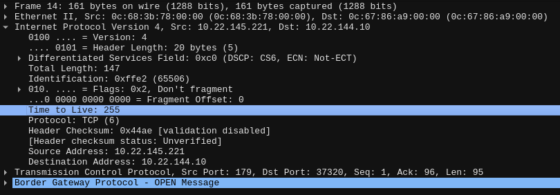

# Do u know BGP?

## Instructions 📝

Votre mission, si toutefois vous l'acceptez, sera d'établir une session bgp avec un routeur de votre réseau local et de récupérer la communauté bgp annoncée avec la route `203.0.113.0/24`.

Voici les informations de peering dont vous aurez besoin :

- Adresse du router : `10.22.145.221/23`
- AS du router : `1337`
- Votre AS : `100`

Le flag sera de la forme : `HSR{XXXXX:XXXXX}`

Bonne chance !

## Flag 🚩

`HSR{1337:65235}`

## Write-up 📝

Pour commencer, nous préparons une VM FRRouting pour le peering bgp.
Vous trouverez ci-dessous un exemple de configuration d'une session bgp.

```txt
interface eth0
 ip address 10.22.144.10/23
exit
!
router bgp 100
 bgp log-neighbor-changes
 no bgp default ipv4-unicast
 neighbor 10.22.145.221 remote-as 1337
 !
 address-family ipv4 unicast
  neighbor 10.22.145.221 activate
  neighbor 10.22.145.221 prefix-list ANY in
 exit-address-family
exit
!
ip prefix-list ANY seq 10 permit any
!
end
```

Malgré cette configuration, aucune route n'est récupérée.
En inspectant les échanges bgp, on remarque que le TTL des paquets provenant du routeur cible est de 255.



Ce comportement alors que nous ne sommes pas dans une situation de ebgp multi-hops, signifie que le Generalized TTL Security Mechanisms (GTSM aka TTL security) est mise en place, tel que defini dans la [rfc5082](https://www.rfc-editor.org/rfc/rfc5082).

Nous ajoutons donc cet élément à notre configuration.

```txt
router bgp 100
 bgp log-neighbor-changes
 no bgp default ipv4-unicast
 neighbor 10.22.145.221 remote-as 1337
 neighbor 10.22.145.221 ttl-security hops 1
[...]
```

Suite à cette modification, nous sommes maintenant en mesure de recevoir des routes de l'AS 1337.

```txt
frr# sh ip bgp
BGP table version is 1, local router ID is 10.22.144.10, vrf id 0
Default local pref 100, local AS 100
Status codes:  s suppressed, d damped, h history, * valid, > best, = multipath,
               i internal, r RIB-failure, S Stale, R Removed
Nexthop codes: @NNN nexthop's vrf id, < announce-nh-self
Origin codes:  i - IGP, e - EGP, ? - incomplete
RPKI validation codes: V valid, I invalid, N Not found

   Network          Next Hop            Metric LocPrf Weight Path
*> 203.0.113.0/24   10.22.145.221            0             0 1337 i

Displayed  1 routes and 1 total paths
```

En inspectant la route annoncée, nous trouvons la communauté bgp associée.

```txt
frr# sh ip bgp 203.0.113.0/24
BGP routing table entry for 203.0.113.0/24, version 1
Paths: (1 available, best #1, table default)
  Not advertised to any peer
  1337
    10.22.145.221 from 10.22.145.221 (1.1.1.1)
      Origin IGP, metric 0, valid, external, best (First path received)
      Community: 1337:65235
      Last update: Thu Mar 28 22:16:18 2024
```

Le flag est donc `HSR{1337:65235}`.
