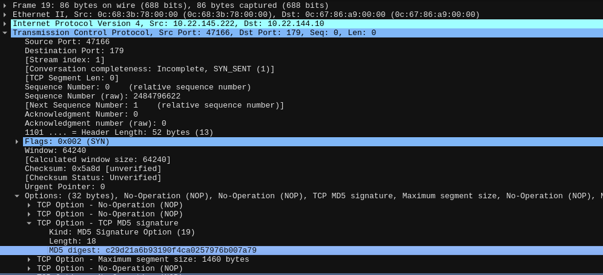

# BGP Connection Code Quest

## Instructions 📝

Votre mission, si toutefois vous l'acceptez, sera d'établir une session bgp avec un routeur de votre réseau local et de récupérer la communauté bgp annoncée avec la route `203.0.113.0/24`.

Voici les informations de peering dont vous aurez besoin :

- Adresse du router : `10.22.145.222/23`
- AS du router : `1337`
- Votre AS : `100`

Le flag sera de la forme : `HSR{XXXXX:XXXXX}`

Bonne chance !

## Flag 🚩

`HSR{1337:45138}`

## Write-up 📝

Pour commencer, nous préparons une VM FRRouting pour le peering bgp.
Vous trouverez ci-dessous un exemple de configuration d'une session bgp.

```txt
interface eth0
 ip address 10.22.144.10/23
exit
!
router bgp 100
 bgp log-neighbor-changes
 no bgp default ipv4-unicast
 neighbor 10.22.145.222 remote-as 1337
 !
 address-family ipv4 unicast
  neighbor 10.22.145.222 activate
  neighbor 10.22.145.222 prefix-list ANY in
 exit-address-family
exit
!
ip prefix-list ANY seq 10 permit any
!
end
```

Malgré cette configuration, aucune route n'est récupérée.
En inspectant les échanges réseau, nous remarquons que les paquets provenant du routeur cible contiennent l'option `TCP MD5 signature`.



Une authentification MD5 est donc utilisée pour établir une session bgp, tel que défini dans [rfc2385](https://www.rfc-editor.org/rfc/rfc2385).
Nous allons maintenant essayer de trouver le secret correspondant.

Pour cela, il faut récupérer le hash et le sel utilisé pour le générer.

```txt
$ ./pcap2john.py md5.pcap > hashes.txt
$ cat hashes.txt

$tcpmd5$0a1691de0a16900a00060034b83e00b3941afcce00000000d002faf000000000$c29d21a6b93190f4ca0257976b007a79
$tcpmd5$0a1691de0a16900a00060034b83e00b3941afcce00000000d002faf000000000$c29d21a6b93190f4ca0257976b007a79
[...]
```

Après cela, nous pouvons passer au craquage du hash via un dictionnaire.

```txt
$ john --wordlist=/usr/share/wordlists/rockyou.txt hashes.txt
Using default input encoding: UTF-8
Loaded 1 password hash (tcp-md5, TCP MD5 Signatures, BGP, MSDP [MD5 32/64])
Will run 4 OpenMP threads
Press 'q' or Ctrl-C to abort, almost any other key for status
Warning: Only 1 candidate left, minimum 4 needed for performance.
lalily           (?)     
1g 0:00:00:00 DONE (2024-03-28 18:41) 100.0g/s 100.0p/s 100.0c/s 100.0C/s lalily
Warning: passwords printed above might not be all those cracked
Use the "--show" option to display all of the cracked passwords reliably
Session completed.
```

Ayant découvert que le secret `lalily` était utilisé pour sécuriser les échanges bgp sur le routeur cible.
Nous ajoutons donc cet élément à notre configuration.

```txt
router bgp 100
 bgp log-neighbor-changes
 no bgp default ipv4-unicast
 neighbor 10.22.145.222 remote-as 1337
 neighbor 10.22.145.222 password lalily
[...]
```

Suite à cette modification, nous sommes maintenant en mesure de recevoir des routes de l'AS 1337.

```txt
frr# sh ip bgp
BGP table version is 1, local router ID is 10.22.144.10, vrf id 0
Default local pref 100, local AS 100
Status codes:  s suppressed, d damped, h history, * valid, > best, = multipath,
               i internal, r RIB-failure, S Stale, R Removed
Nexthop codes: @NNN nexthop's vrf id, < announce-nh-self
Origin codes:  i - IGP, e - EGP, ? - incomplete
RPKI validation codes: V valid, I invalid, N Not found

   Network          Next Hop            Metric LocPrf Weight Path
*> 203.0.113.0/24   10.22.145.222            0             0 1337 i

Displayed  1 routes and 1 total paths
```

En inspectant la route annoncée, nous trouvons la communauté bgp associée.

```txt
frr# sh ip bgp 203.0.113.0/24
BGP routing table entry for 203.0.113.0/24, version 1
Paths: (1 available, best #1, table default)
  Not advertised to any peer
  1337
    10.22.145.222 from 10.22.145.222 (2.2.2.2)
      Origin IGP, metric 0, valid, external, best (First path received)
      Community: 1337:45138
      Last update: Thu Mar 28 22:27:28 2024
```

Le flag est donc `HSR{1337:45138}`.
