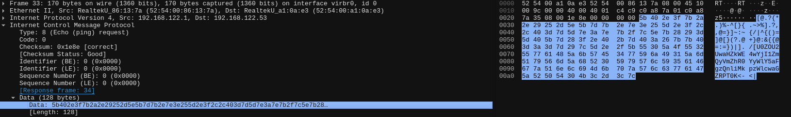

# ICMP Comedy Club

## Instructions 📝

Des échanges de données étranges circulent sur le réseau.
Un extrait a été intercepté par nos soins, à vous de l'analyser.

La capture réseau est disponible [ici](http://10.22.148.10/~hsr224/icmp-exfiltration/capture.pcap).

## Flag 🚩

`HSR{Houston_we_have_a_problem!}`

## Write-up 📝

L'analyse de la capture se fait avec Wireshark.

Nous découvrons une séquence de caractères qui semble être exploitable dans l'un des paquets icmp.



Nous décodons la contenu en base64 deux fois, puis trouvons le flag.

```txt
$ printf "U0ZOU2UwaHZkWE4wYjI1ZmQyVmZhR0YyWlY5aFgzQnliMkpzWlcwaGZRPT0K" | base64 -d
SFNSe0hvdXN0b25fd2VfaGF2ZV9hX3Byb2JsZW0hfQ==

$ printf "SFNSe0hvdXN0b25fd2VfaGF2ZV9hX3Byb2JsZW0hfQ==" | base64 -d
HSR{Houston_we_have_a_problem!}
```
