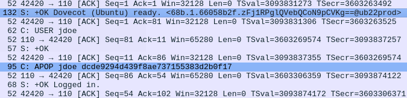

# POP3 Password Pursuit

## Instructions 📝

Une authentification POP3 a été interceptée en clair par l'écoute d'un réseau.
A vous de trouver le mot de passe du compte.

Le flag sera de la forme : `HSR{mot de passe}`

La capture réseau est disponible [ici](http://10.22.148.10/~hsr224/pop-cred/capture.pcap).

## Flag 🚩

`HSR{LAUPALANGIHE4}`

## Write-up 📝

L'analyse de la capture se fait avec Wireshark.

Nous decouvrons que l'authentification s'est fait en APOP.



Sur la base de la [rfc1939](https://www.rfc-editor.org/rfc/rfc1939), nous récupèrons le "shared secret" et l'utilisons comme salt.
Puis nous passons le tout à hashcat avec le dictionnaire `rockyou`.

```txt
$ hashcat -m 20 -a 3 'dcde9294d439f8ae737155383d2b0f17:<68b.1.66058b2f.zFj1RPglQVebQCoN9pCVKg==@ub22prod>' /usr/share/wordlists/rockyou.txt --show
dcde9294d439f8ae737155383d2b0f17:<68b.1.66058b2f.zFj1RPglQVebQCoN9pCVKg==@ub22prod>:LAUPALANGIHE4
```

Le mot de passe est `LAUPALANGIHE4`.
