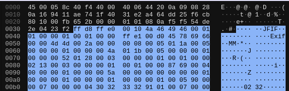
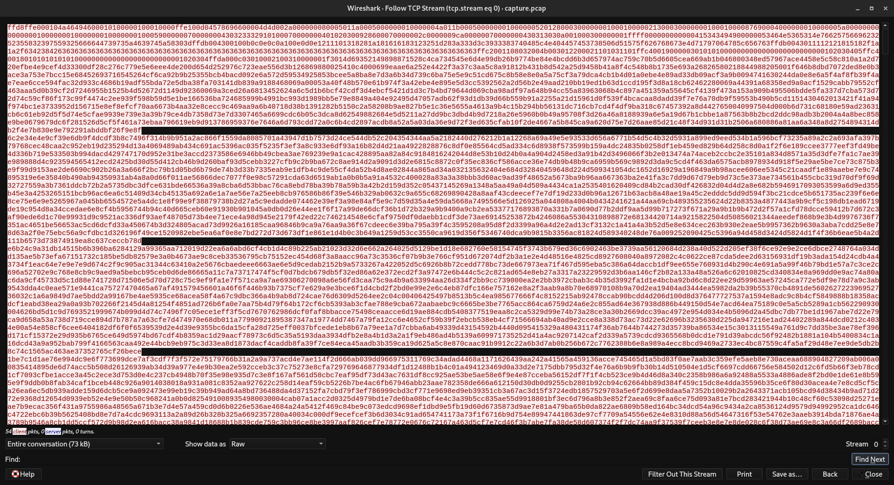

# Network Anomaly Adventure

## Instructions 📝

Des échanges de données étranges circulent sur le réseau.
Un message a été intercepté par nos soins, à vous de l'analyser.

La capture réseau est disponible [ici](http://10.22.148.10/~hsr224/tcp-stream/capture.pcap).

## Flag 🚩

`HSR{Somebody_once_told_me}`

## Write-up 📝

L'analyse de la capture se fait avec Wireshark.

Nous remarquons l'entete d'un fichier JPEG dans les donnees des segment TCP.



Le contenu peut être récupéré en sélectionnant l'option "Follow TCP Stream".



Nous pouvons alors extraire les données Exif de l'image.

```txt
$ exiftool HSR/hello.jpg 
ExifTool Version Number         : 12.40
File Name                       : hello.jpg
Directory                       : HSR
File Size                       : 72 KiB
File Modification Date/Time     : 2024:03:28 08:45:27+00:00
File Access Date/Time           : 2024:03:28 08:46:52+00:00
File Inode Change Date/Time     : 2024:03:28 08:46:26+00:00
File Permissions                : -rw-r--r--
File Type                       : JPEG
File Type Extension             : jpg
MIME Type                       : image/jpeg
JFIF Version                    : 1.01
Exif Byte Order                 : Big-endian (Motorola, MM)
X Resolution                    : 1
Y Resolution                    : 1
Resolution Unit                 : None
Y Cb Cr Positioning             : Centered
Exif Version                    : 0232
Components Configuration        : Y, Cb, Cr, -
User Comment                    : SFNSe1NvbWVib2R5X29uY2VfdG9sZF9tZX0=
Flashpix Version                : 0100
Color Space                     : Uncalibrated
Image Width                     : 1200
Image Height                    : 800
Encoding Process                : Progressive DCT, Huffman coding
Bits Per Sample                 : 8
Color Components                : 3
Y Cb Cr Sub Sampling            : YCbCr4:2:0 (2 2)
Image Size                      : 1200x800
Megapixels                      : 0.960
```

Et décoder le message en base64.

```txt
$ printf 'SFNSe1NvbWVib2R5X29uY2VfdG9sZF9tZX0=' | base64 -d
HSR{Somebody_once_told_me}
```
